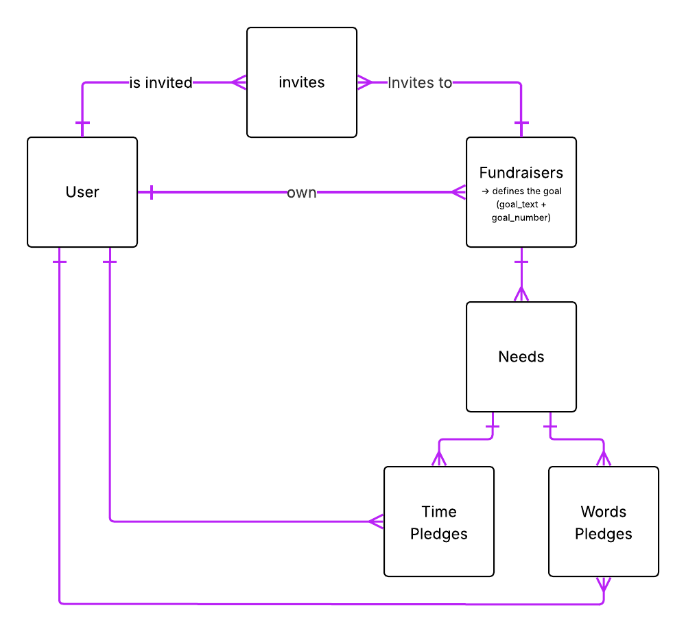

# crowdfunding_back_end
A repo that contains my She Codes back end project

# Crowdfunding Back End
Name: TWOGTHER

## Planning:
### Concept/Name
Twogther is a community-driven platform for inner circles—friends, family, and close communities; to support each other through meaningful actions instead of money. In a hyper-connected world where loneliness is rising, Twogther makes care visible, showing how our closest people show up, help, and grow together.

### Intended Audience/User Stories
Our audience is anyone who wants to show up for someone they care about. This includes friends, family, colleagues, neighbours, and small communities. Twogther is made for the people closest to us; the ones we turn to when life gets heavy or we simply need a little support.

They will use the website to:
 - Create a fundraiser “care-raiser” when they need help
 - Invite their inner circle to participate
 - Offer support by pledging time or sending meaningful words
 - Celebrate progress through fun, visual meters
 - Build stronger, more connected relationships

Twogther gives people a simple, beautiful way to ask for help—and for their circle to say, “I’m here.”

### Front End Pages/Functionality
- Front End Pages / Functionality

1. Home Page
- Explains what Twogther is
- Highlights the concept of invite-only supporters
- CTA: Create a Care-Raiser (fundraiser)

2. User Dashboard
-Shows the user list of fundraisers created
-Shows the user each of the fundraisers progress
-Shows the user invitations to support others fundraisers
-Shows the user reminders of pledges done in other fundraisers
-Shows the user notifications of new pledges done in their fundraiser

3. Create a fundraise Page
-Form to create a new support page
-Add title, description, goal, image/theme
-Owner chooses who can join
-Fundraiser is private by default — only invited supporters can access it

4. Fundraiser Detail Page
-Shows the story and purpose
-Displays the progress visual
-Shows pledges and supporters
-Invite button for the owner to add supporters

If a user tries to access without an invitation, they see a “not authorized / invitation required” message

5. Invitation Page
-Owner selects or inputs who to invite
-Sends invite (email with link with token) "Pending to check" 
-Invitees must accept to join the fundraisers

6. Pledge Page
-Only accessible to users who were invited and accepted
-Choose pledge type: Time or Words
-Validated depending on type

Reinforces that this is a trusted inner circle, not a public group

7. Profile Settings
-User info and preferences
-Manage invitations

9. Login / Signup Page
-Required for creating or accepting invitations

### API Spec

| URL | HTTP Method | Purpose | Success Response Code | Authentication/Authorisation | Request Body |
| - | - | - | - | - | - |
|https://twogther-f6514e86beb9.herokuapp.com/users/ | POST |  Create Users | 201 Created | N/A|{"username": "","first_name": "","last_name": "","email": "","password": ""}|
|https://twogther-f6514e86beb9.herokuapp.com/api-token-auth/ | POST | Create Token AUTH   | 200 OK | N/A |{"username": "","password": ""}|
|https://twogther-f6514e86beb9.herokuapp.com/fundraisers/| POST | Create fundraiser   | 201 Created| Req Token |{"title": "","description": "","goal_text": "","goal_number": #,"image": "https://","is_open": true}|
|4. Supporter User (HK)/users/ | POST | Create Users | 201 Created | N/A |
|5. Supporter User Log In (HK) Token /api-token-auth/  | POST | Create Token AUTH   | 200 OK         | N/A|
|https://twogther-f6514e86beb9.herokuapp.com/invite/ | POST | Authorise Supporter | 201 Created | Fund Owner Token |{"user": #id,"fundraiser": #id}|
|https://twogther-f6514e86beb9.herokuapp.com/pledges/| POST | Create Pledge (T/W) | 201 Created | Supp Pledge Token |{"type": "",  "action": "","comment": "","fundraiser": #id}|
|8. Pledge User No invited (HK)/pledges/ | POST | Create Pledge (T/W) | 403 Forbiden   | Supp Pledge Token|  
|https://twogther-f6514e86beb9.herokuapp.com/fundraisers/ | GET  | Show Fundraiser List| 200 OK | N/A |
|https://twogther-f6514e86beb9.herokuapp.com/users/| GET  | Show Users List | 200 OK | N/A |
|https://twogther-f6514e86beb9.herokuapp.com/pledges/| GET  | Show Pledges List | 200 OK | N/A |

### DB Schema

